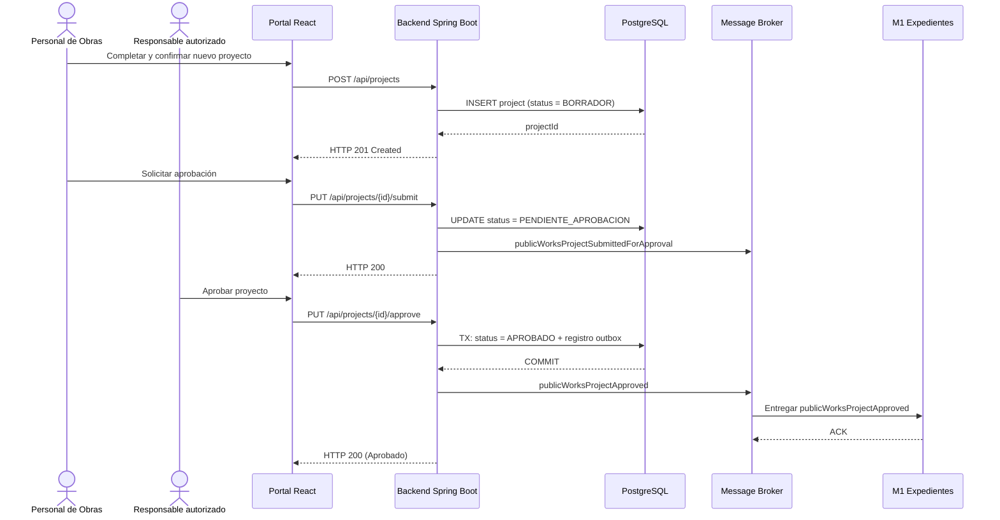

# Secuencia propuesta — aprobación de un proyecto

## Alcance y certeza

La secuencia muestra un diseño técnico posible con portal React, backend Spring Boot, PostgreSQL y un broker de Azure todavía no elegido. React y Spring Boot provienen de la tarjeta DevOps recibida; deben confirmarse contra los repositorios reales. Los eventos hacia M1 siguen en estado `RECEIVED`.

La publicación confiable mediante outbox, reintentos y DLQ es una propuesta DevOps. Service Bus frente a Event Grid, y las convenciones definitivas del evento, siguen pendientes.
